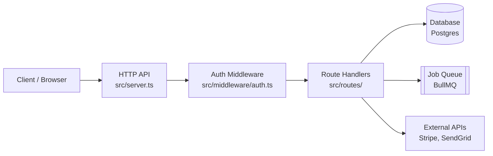
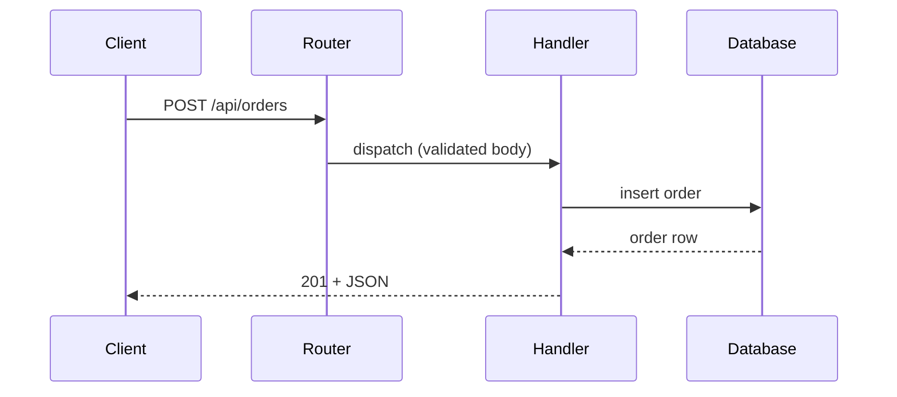
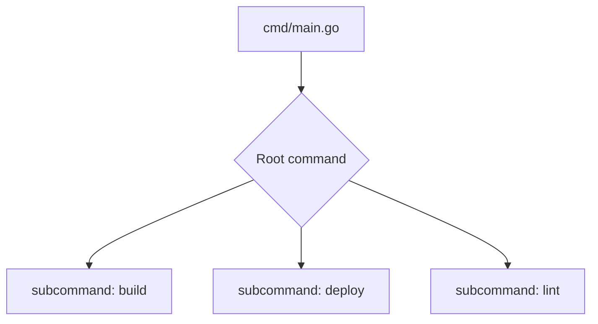
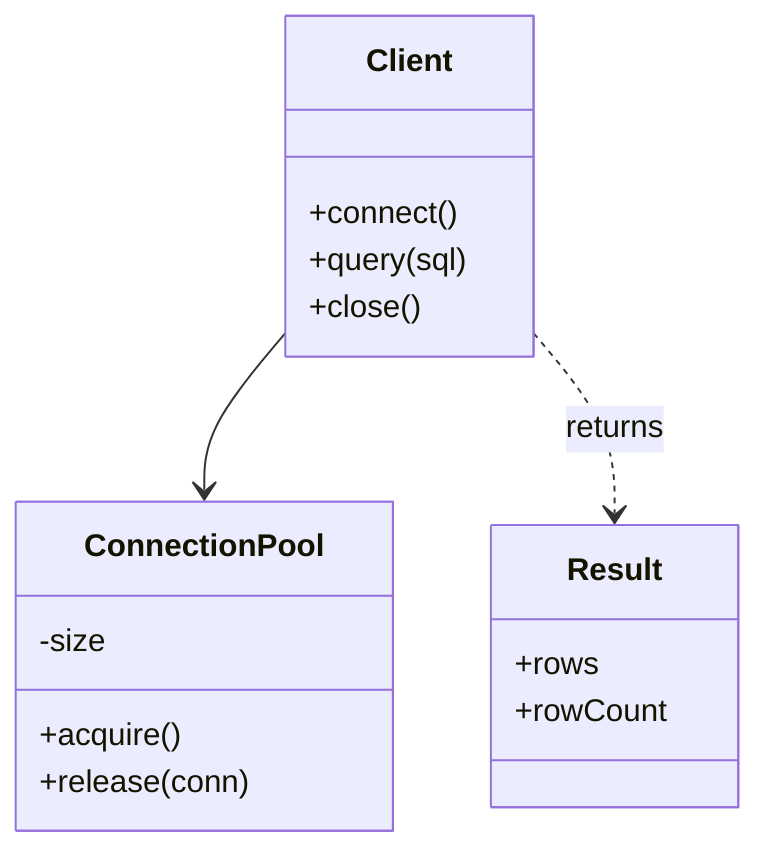
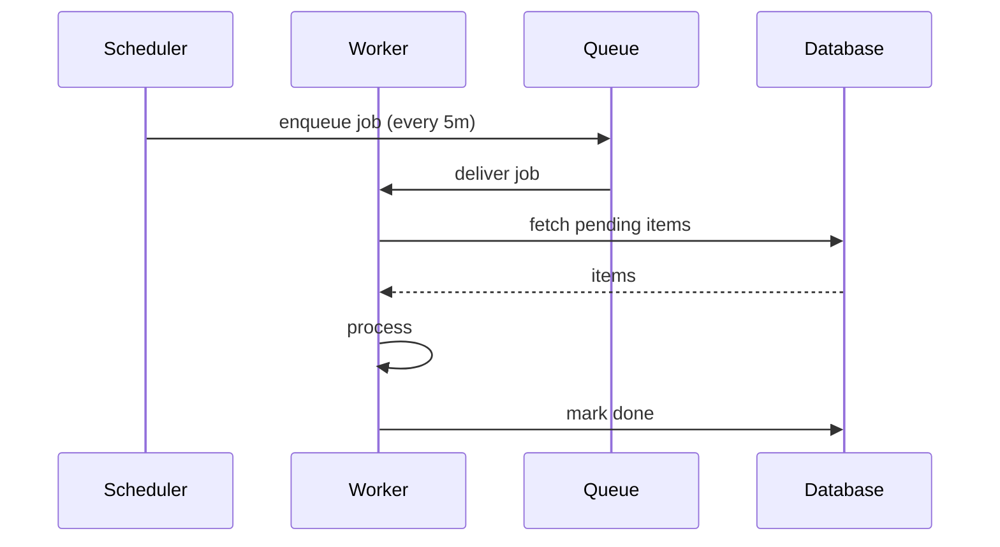
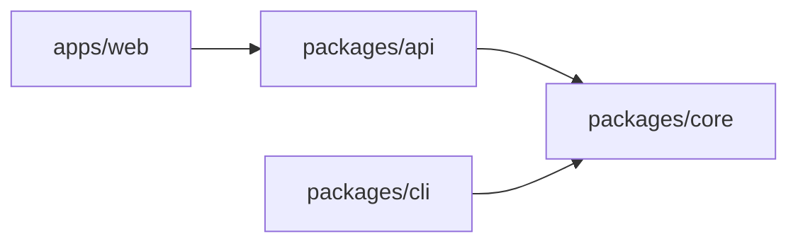

# Mermaid Diagram Patterns

This guide tells the skill **when** and **how** to embed Mermaid diagrams in the generated `docs/`. Diagrams render natively on GitHub, GitLab, and most Markdown viewers — no extra tooling required.

## When to include diagrams

**Default: on.** Mermaid diagrams are included automatically unless one of the skip conditions applies.

### Skip when

- **Small projects** — fewer than ~5 source files, or a single-file script. A diagram with 1–2 nodes adds noise, not signal.
- **User opts out** — the user passed `--no-mermaid` or said something like "skip diagrams", "no mermaid", "sem diagramas".
- **No coherent flow exists** — e.g. a flat utility library where every function is independent.

When skipping, just produce the textual documentation as before. Do not leave empty code fences.

## Where to put diagrams

| Location | Diagram | Purpose |
| --- | --- | --- |
| `overview.md` | `flowchart` (high-level) | Sources → core → outputs → integrations |
| `architecture/http-api.md` | `sequenceDiagram` | Request lifecycle (client → router → handler → DB → response) |
| `architecture/cli.md` | `flowchart` | Command dispatch tree |
| `architecture/library-api.md` | `classDiagram` | Public exports + relationships |
| `architecture/workers.md` / `cron-jobs.md` | `sequenceDiagram` or `flowchart` | Job trigger → fetch → process → side effects |
| `architecture/project-structure.md` | (optional) `flowchart LR` | Folder dependency graph if non-obvious |

**One diagram per file maximum.** More than one and readers stop reading.

## Grounding rule (critical)

**Every node / box / actor must map to a real file, module, class, or external service that you read in the code.** Diagrams are documentation, not marketing. If you cannot point to the source file for a node, drop the node.

Cite the source under the diagram. **All cited paths and any `click` directives must be relative to the doc file containing the diagram** — never `/Users/...`, `/home/...`, `/src/...`, or other absolute / root-anchored forms. The diagram must work after `git clone` on any machine.

```markdown
> Source: [src/server.ts](../../src/server.ts), [src/routes/](../../src/routes/), [src/db/client.ts](../../src/db/client.ts)
```

If you use `click` directives to make nodes navigable, apply the same rule:

```mermaid
click API "../../src/server.ts" "Open server.ts"
```

## Templates

### 1. HTTP service — `overview.md` flowchart



### 2. HTTP service — `architecture/http-api.md` sequence



### 3. CLI tool — `architecture/cli.md` flowchart



### 4. Library — `architecture/library-api.md` classDiagram



### 5. Worker / cron — `architecture/workers.md` sequence



### 6. Monorepo — `architecture/project-structure.md` package graph



## Style notes

- Keep node labels short — file/module name first, role on a second line via `<br/>`.
- Prefer `LR` (left-to-right) for overview flowcharts; `TD` (top-down) for trees and command dispatch.
- Use `[(Cylinder)]` for databases, `[[Subroutine]]` for queues/workers, `{Diamond}` for decisions, default rectangles for code.
- Don't color nodes — default theme renders cleanly in light and dark mode.
- Don't exceed ~10 nodes per diagram. If you need more, split or pick the most important subgraph.

## Localization

The Mermaid syntax stays English-keyword (`flowchart`, `sequenceDiagram`, `participant`). **Node labels and inline comments are translated** to the target language when `LANG != en`. Source-file paths inside labels are never translated.
